# 应用层跟踪库Apptrace

## 功能简介:

主要功能一共有四个,目前探索了两个

1. 收集来自特定应用程序的数据。具体请参阅 [特定应用程序的跟踪](https://docs.espressif.com/projects/esp-idf/zh_CN/latest/esp32/api-guides/app_trace.html#app-trace-application-specific-tracing)。
2. 记录到主机的轻量级日志。具体请参阅 [记录日志到主机](https://docs.espressif.com/projects/esp-idf/zh_CN/latest/esp32/api-guides/app_trace.html#app-trace-logging-to-host)。
3. 系统行为分析。具体请参阅 [基于 SEGGER SystemView 的系统行为分析](https://docs.espressif.com/projects/esp-idf/zh_CN/latest/esp32/api-guides/app_trace.html#app-trace-system-behaviour-analysis-with-segger-systemview)。(同时连jtag还有uart)
4. 获取源代码覆盖率。具体请参阅 [Gcov（源代码覆盖）](https://docs.espressif.com/projects/esp-idf/zh_CN/latest/esp32/api-guides/app_trace.html#app-trace-gcov-source-code-coverage)。


ESP-IDF 中提供了应用层跟踪功能，用于分析应用程序的行为。这一功能在相应的库中实现，可以通过 menuconfig 开启。**此功能允许用户在程序运行开销很小的前提下，通过 JTAG、UART 或 USB 接口在主机和 ESP32 之间传输任意数据。**用户也可同时使用 JTAG 和 UART 接口。UART 接口主要用于连接 SEGGER SystemView 工具（参见 [SystemView](https://www.segger.com/products/development-tools/systemview/))。


## 功能一（特定应用程序的跟踪）:

### 场景

用于追踪数据以及相关变量，与ESP_LOGI函数有点相识，要想实现该功能，修改修改用户程序调用相应的API


#### **与ESP_LOGI函数的相同点和不同点**：

相同：都是将运行时候的数据写出，用来观察程序

不同：Apptrace直接将数据以二进制形式写入输出流，**没有格式化和额外的处理开销**。相比之下，"ESP_LOGI"函数需要解析格式化字符串、处理占位符，并进行相应的转换和格式化操作，这会引入一定的额外开销。


### 方法：

以例程blink举例:

1.创建例程文件
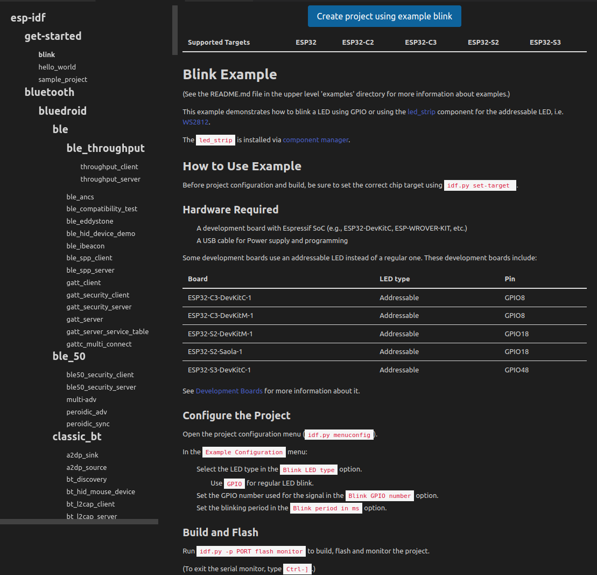

2.如果想要使用apptrace功能,需要更改设置,打开menuconfig,进行如下修改

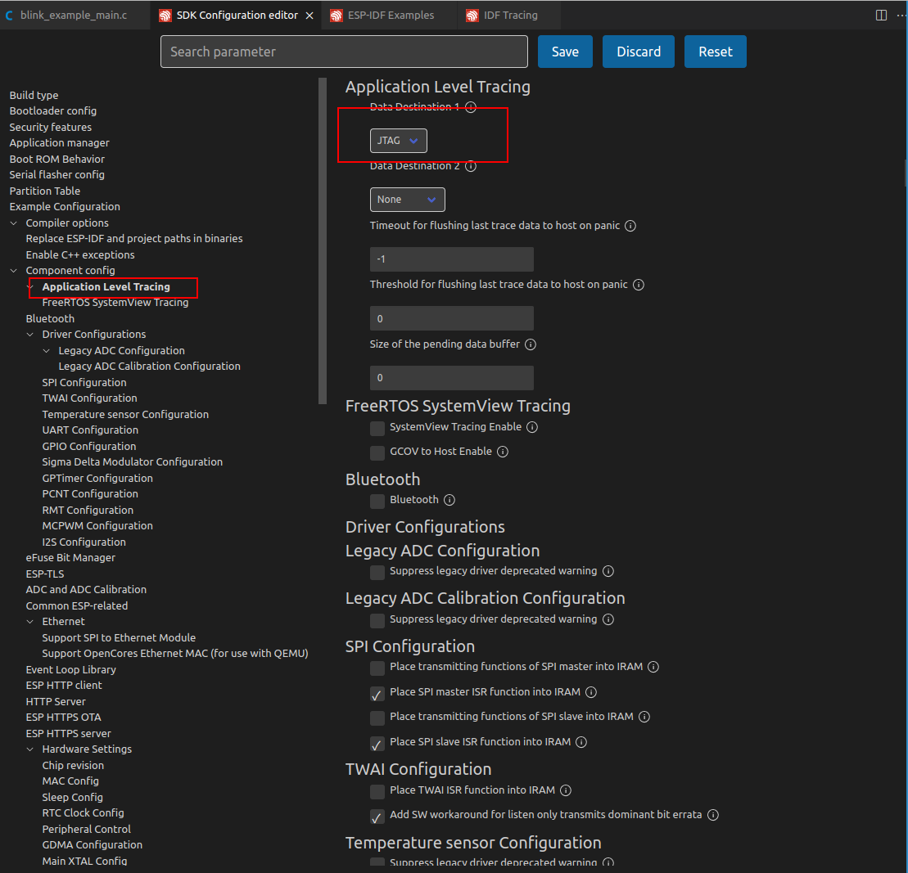

3.修改相关程序

```c
//插入头文件
#include "esp_app_trace.h"
#include "string.h"


//main函数修改如下

void app_main(void)
{

    /* Configure the peripheral according to the LED type */
    configure_led();

   
   
    while (1) {
        ESP_LOGI(TAG, "Turning the LED %s!", s_led_state == true ? "ON" : "OFF");
        blink_led();

        s_led_state = !s_led_state;

        char buf[] = "Hello World!  lby \n";

        esp_err_t res = esp_apptrace_write(ESP_APPTRACE_DEST_TRAX, buf, strlen(buf), ESP_APPTRACE_TMO_INFINITE);

        esp_apptrace_flush(ESP_APPTRACE_DEST_TRAX, 100); 

        if (res != ESP_OK) {
            ESP_LOGE(TAG, "Failed to write data to host!");
            return ;
        }

        vTaskDelay(CONFIG_BLINK_PERIOD / portTICK_PERIOD_MS);
    }
}
```


4.正常编译下载

5.点击apptrace,等待下面出现日志文件

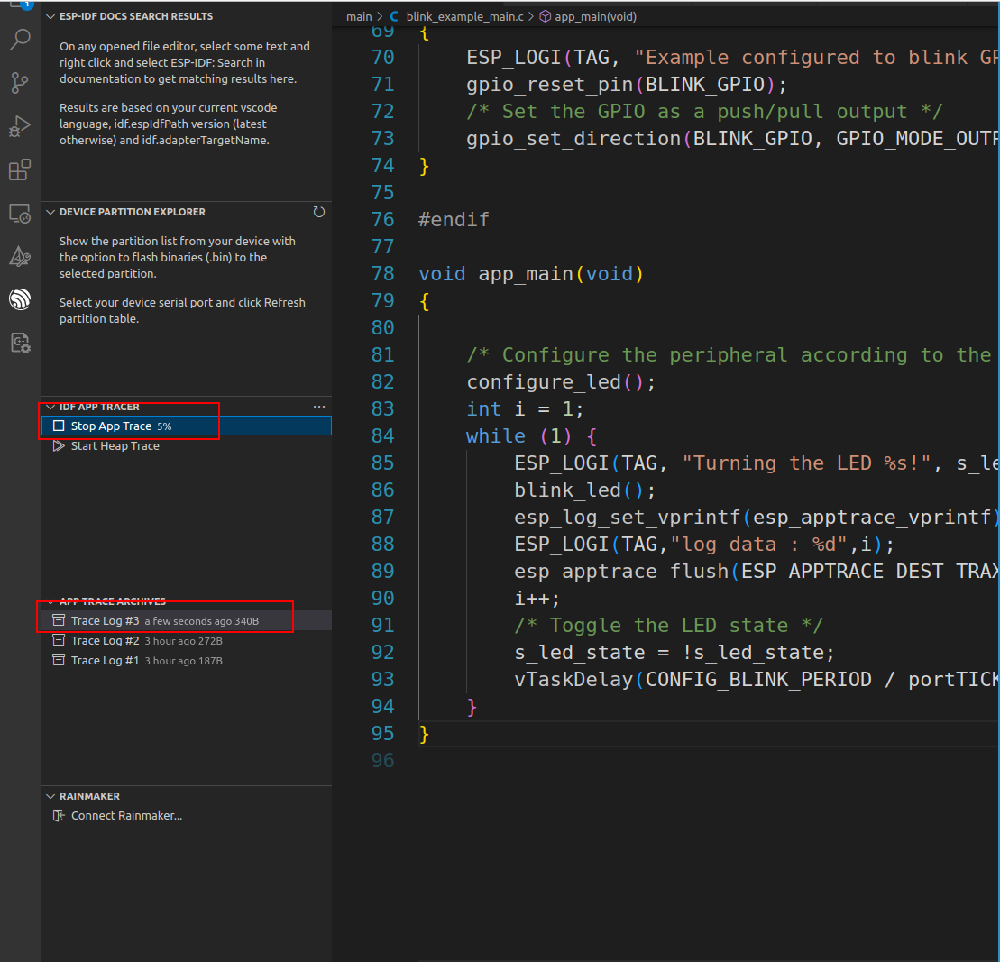

6.打开log文件观察

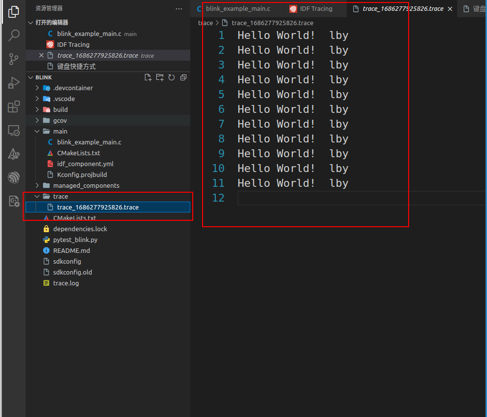


### 总结

和直接打印相差不大，但是可以有效的提高效率，可以先多次写进缓冲区最后一块传输到主机，比ESP_LOGI每一个字节到要单独传输相比，效率可以有很大的提高


## 功能二（记录日志到主机）:

### 场景:

记录日志到主机是 ESP-IDF 中一个非常实用的功能：通过应用层跟踪库将日志保存到主机端。某种程度上，这也算是一种半主机 (semihosting) 机制，相较于调用 `ESP_LOGx` 将待打印的字符串发送到 UART 的日志记录方式，此功能将大部分工作转移到了主机端，从而减少了本地工作量。

### 方法:

以例程blink举例:

1.创建例程文件


2.如果想要使用apptrace功能,需要更改设置,打开menuconfig,进行如下修改


3.添加相应的api函数,将main函数修改如下:

```c
//添加头文件       
#include "esp_app_trace.h"

void app_main(void)
{

    /* Configure the peripheral according to the LED type */
    configure_led();
    int i = 1;
    while (1) {
        ESP_LOGI(TAG, "Turning the LED %s!", s_led_state == true ? "ON" : "OFF");
        blink_led();
        esp_log_set_vprintf(esp_apptrace_vprintf);
        ESP_LOGI(TAG,"log data : %d",i);
        esp_apptrace_flush(ESP_APPTRACE_DEST_TRAX, 1000); 
        i++;
        /* Toggle the LED state */
        s_led_state = !s_led_state;
        vTaskDelay(CONFIG_BLINK_PERIOD / portTICK_PERIOD_MS);
    }
}
```

**代码解释:**

具体函数的API链接：https://docs.espressif.com/projects/esp-idf/en/latest/esp32/api-reference/system/app_trace.html

```c
 //将日志数据发送给主机
 esp_log_set_vprintf(esp_apptrace_vprintf);
 //如需将日志数据再次重定向给 UART，请使用esp_log_set_vprintf(vprintf);
 
 //打印需要观测的数据
 ESP_LOGI(TAG,"log data : %d",i);
 
 //将跟踪缓冲区中的剩余数据刷新到主机。
  esp_apptrace_flush(ESP_APPTRACE_DEST_TRAX, 1000); 
  
  esp_err_t esp_apptrace_flush ( esp_apptrace_dest_t dest , uint32_t tmo )
    – dest 指示刷新数据的硬件接口。
        ESP_APPTRACE_DEST_JTAG 或者ESP_APPTRACE_DEST_TRAX  是JTAG 
        ESP_APPTRACE_DEST_UART  是UART
    – tmo 设置超时时间。使用 ESP_APPTRACE_TMO_INFINITE 无限期等待。
```

4.正常编译下载

5.点击apptrace,等待下面出现日志文件


6.打开日志文件,观察检测的内容

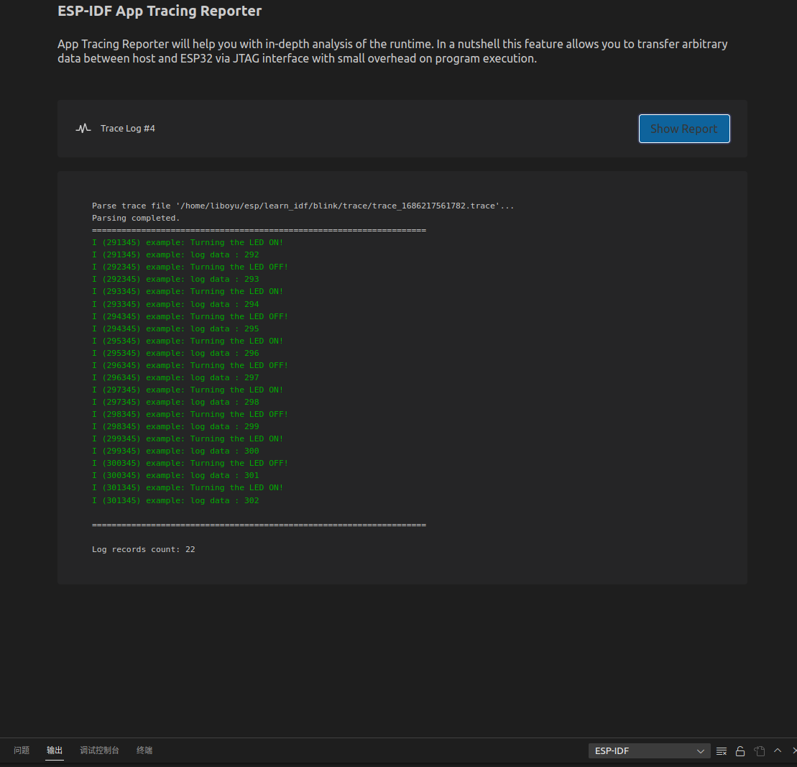

这样即可跟踪想要观察的数据以及变量.


### 总结

通过应用层跟踪库将日志保存到主机端。相较于调用 `ESP_LOGx` 将待打印的字符串发送到 UART 的日志记录方式，此功能将大部分工作转移到了主机端，从而减少了本地工作量


## 功能三（系统行为分析）：

### 场景：

系统行为分析可以捕获和显示任务调度的信息，包括任务的执行顺序、切换时间等。这有助于分析系统的实时行为，验证调度算法的正确性，以及调整任务的优先级和时间片分配，以满足实时性要求。通过可视化系统事件和任务活动，可以更容易地发现代码执行的瓶颈、资源竞争、死锁等问题。查看任务执行时间、中断频率、资源利用率等指标，可以确定需要优化的部分，并采取相应的措施提高系统的响应性能和效率。


### 使用方法：

1.新建例程，直接用不需要修改

2.修改相关配置
在enuconfig 中开启 SystemView Tracing Enable

Component config` > `Application Level Tracing` > `FreeRTOS SystemView Tracing

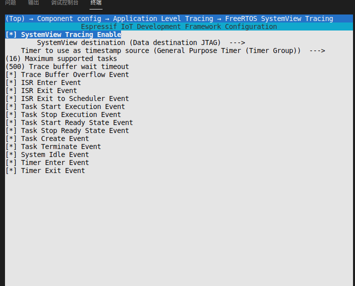

3.编译下载，打开openocd

4.输入telnet localhost 4444后输入

```
esp sysview start file://pro-cpu.SVDat file://app-cpu.SVDat
```

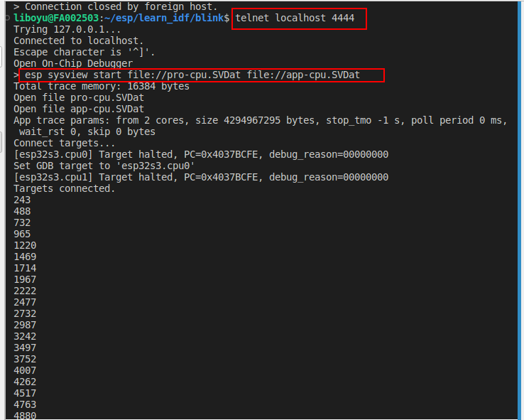

5.下载systemview软件并且打开生成的svdat 文件

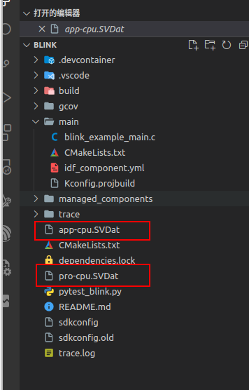

可以看出CPU在各个时间段的工作状态以及相关的外设占用情况

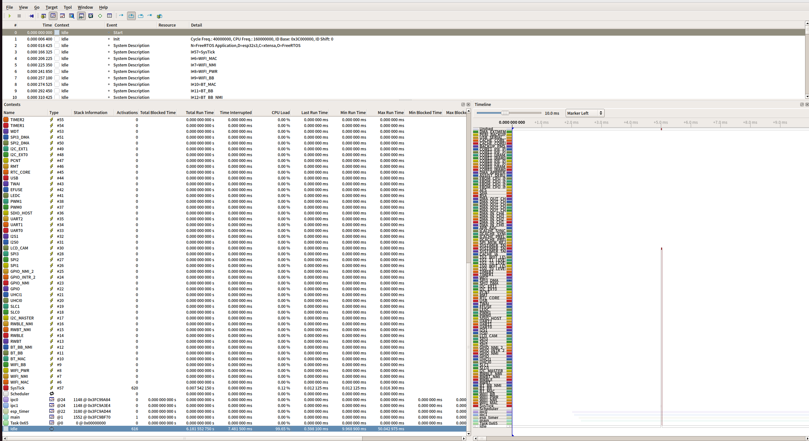


## 功能四（获取源代码覆盖率）：

### 场景：

源代码覆盖率是指示程序运行时内每个程序执行路径的计数和频率的数据通过分析覆盖率报告，开发人员可以识别出未执行的代码分支、未处理的异常情况等，从而发现潜在的问题，并对代码进行修复和改进。


### 使用方法：

1.新建一个例程

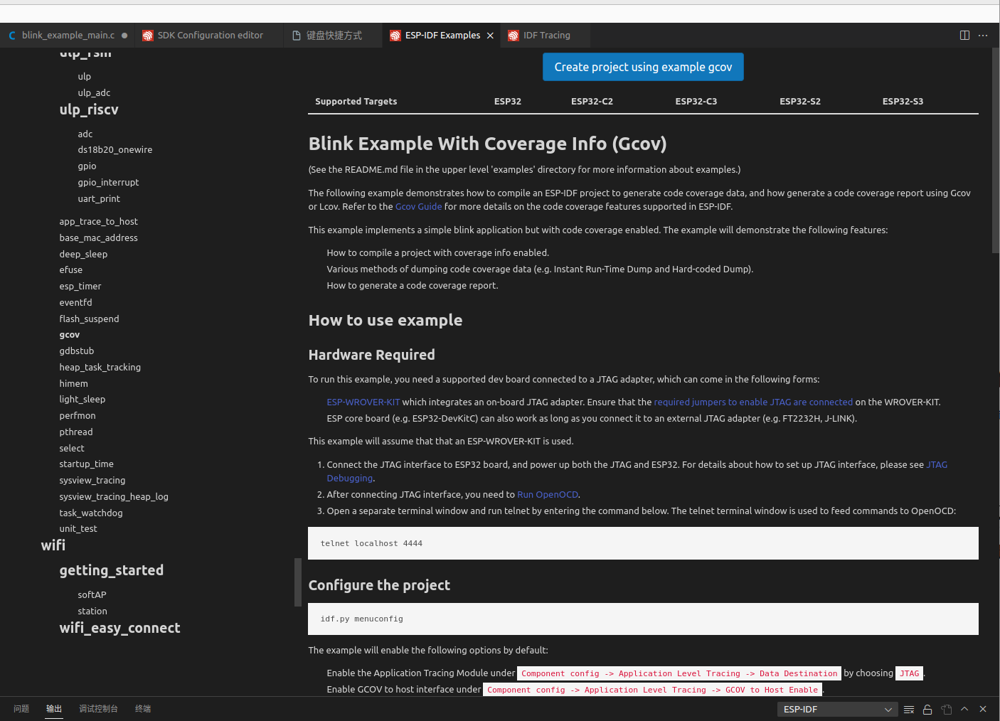

2.开启三个配置

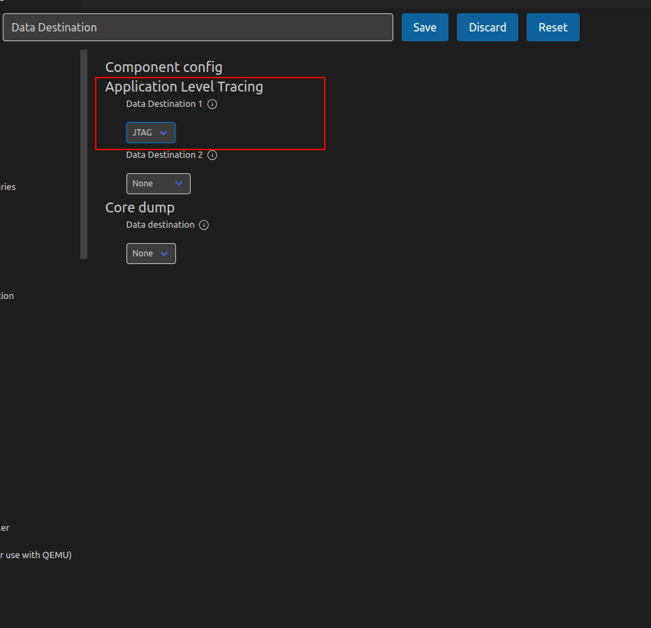

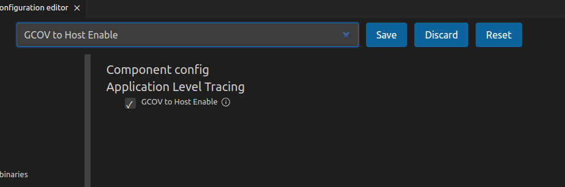

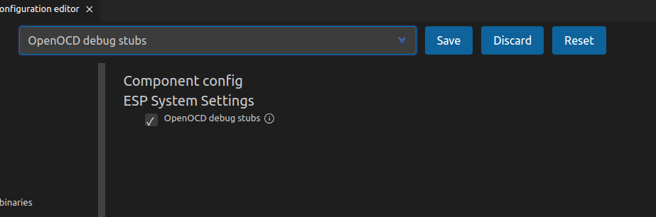

3.正常编译下载

4.打开openocd

5.打开一个新的终端  输入telnet localhost 4444  然后输入esp gcov dump

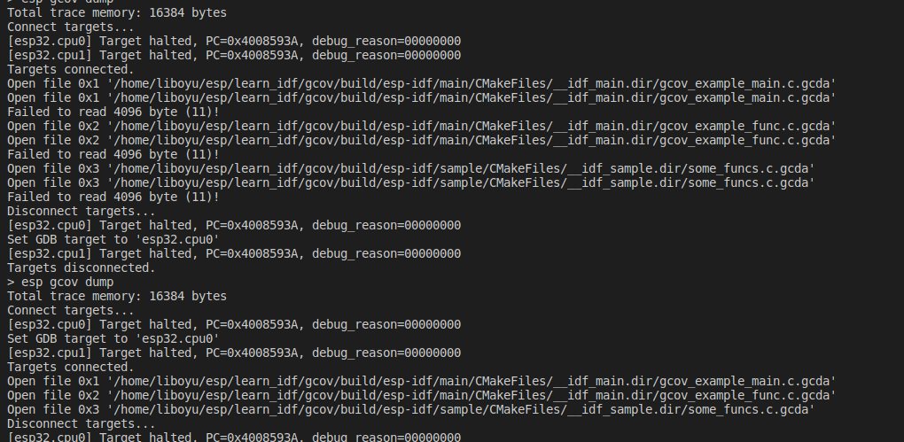

6.打开命令面板输入**ESP-IDF: Add Editor coverage**

### 问题3：没有显示颜色

我的：

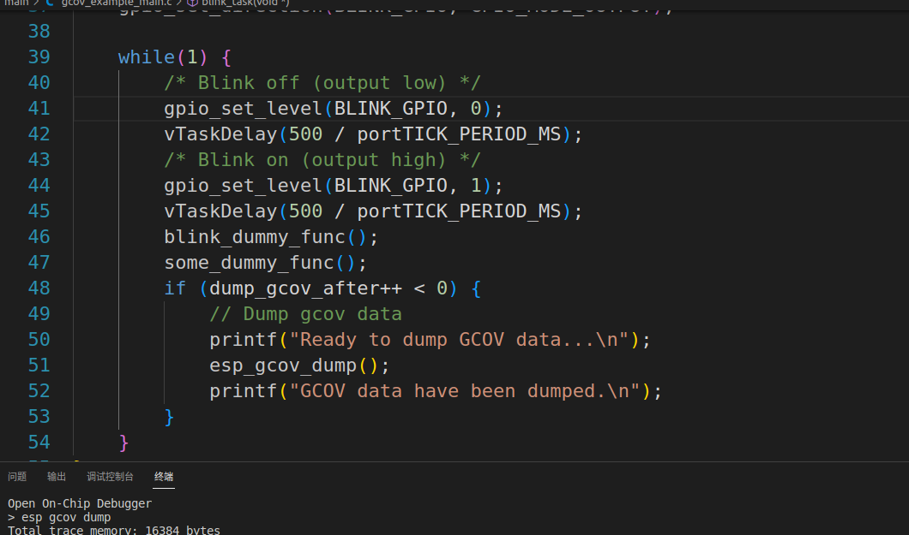

正常的：

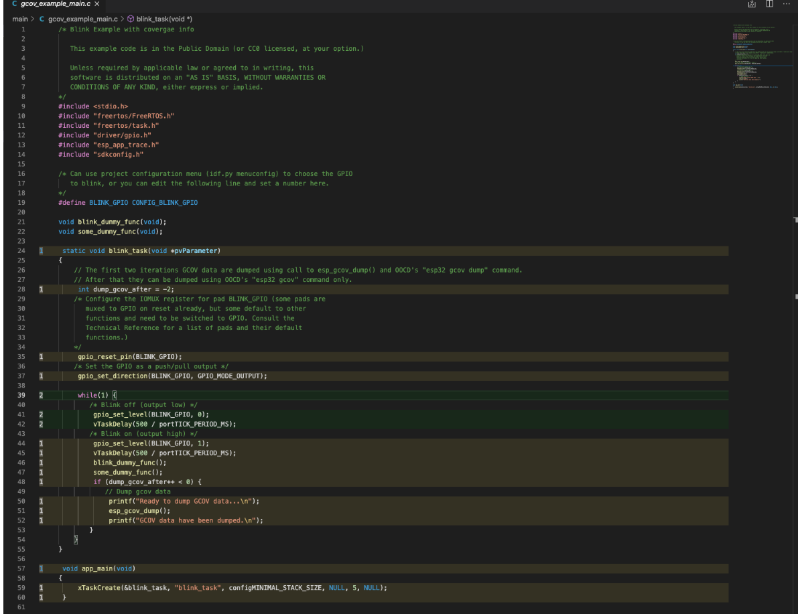

7.输入**ESP-IDF: Get HTML Coverage Report** 

此处结果正确，上一处结果错误

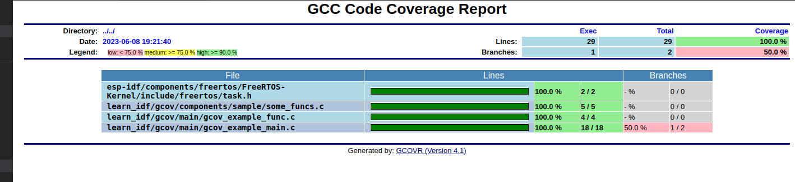


个人觉得这个功能随着idf版本的更新已经无法使用了