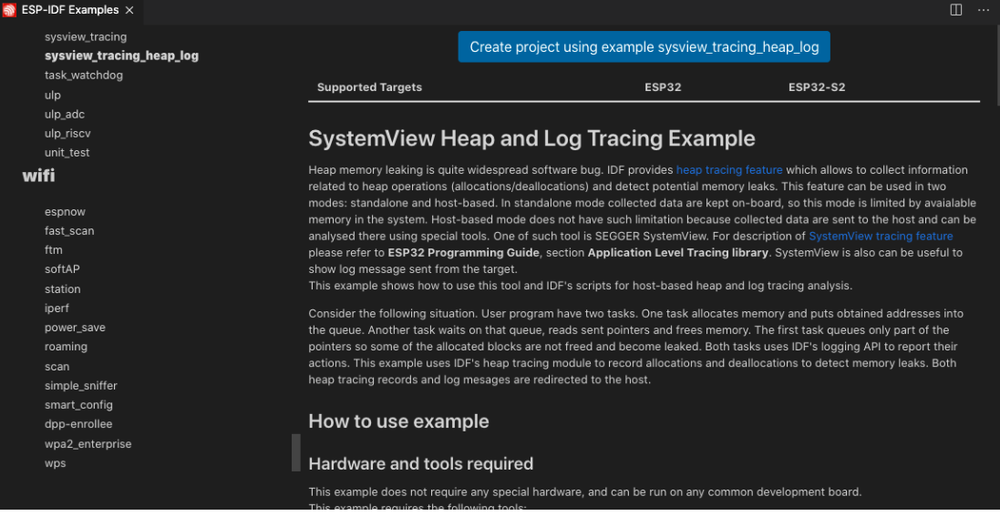
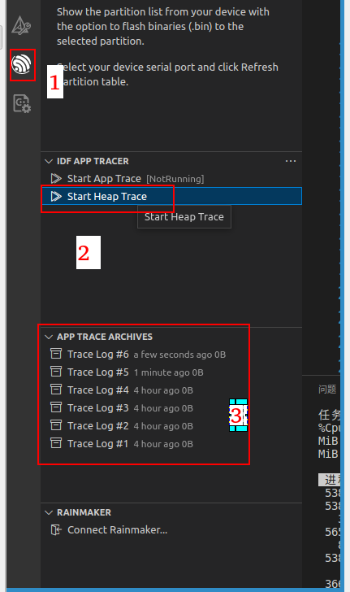
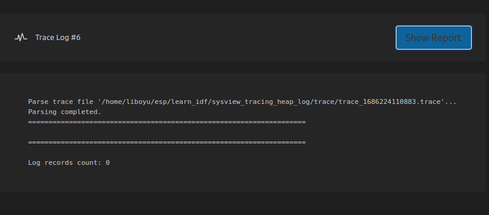
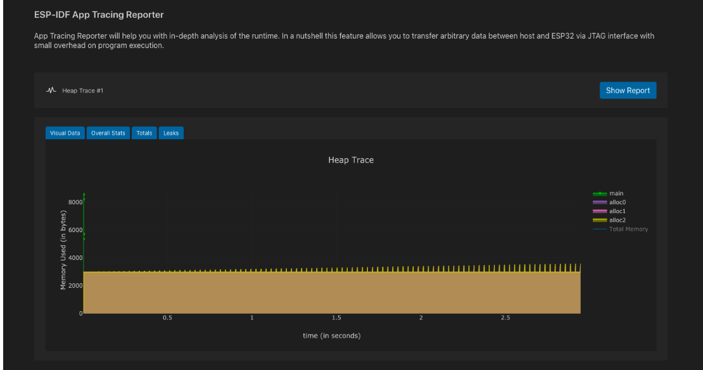
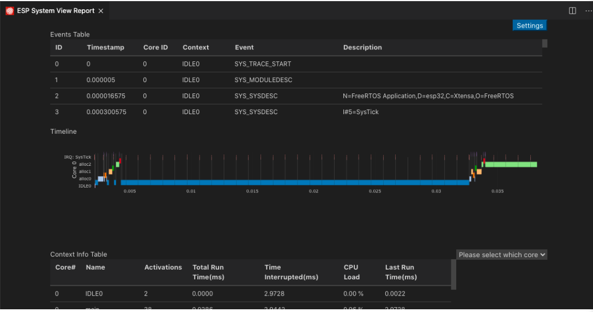

# Heap_trace

## 场景：

用来跟踪分配/释放内存的代码

## 使用方法：

1.打开例程

2.正常的编译下载

3.点击堆跟踪

4.查看report

问题1：

标准的例程里面是有数据的 但是我的没有数据

标准例程

原因猜想：

1. 编译器版本比较老了 这个是两年前的教程，可以需要更换编译器
2. 需要和apptrace一样，自己调整相关代码，不过这个目前没有读懂，明天看一下。
3. 可以我的相关配置不对