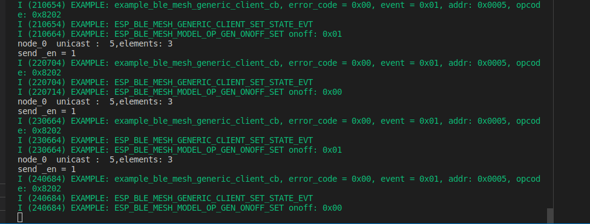
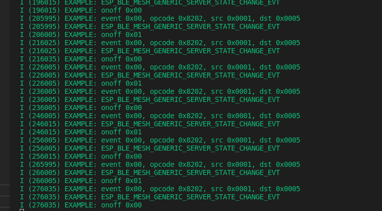

# 蓝牙开关的配网实验

本文利用两个esp32开发板。一块用作prov 并且注册client模型，第二块板子注册server模型实现开发板上灯的亮灭。


mesh网络节点直接通过消息来传递信息，而模型就是实现消息发送的方法，模型包括状态以及操作码等等。


本文档中模型为客户端模型和服务端模型，客户端模型同时扮演配网的角色


本文档的代码如下：

https://gitlab.espressif.cn:6688/jialin/practice/-/tree/feature/blue_code_lby?ref_type=heads


代码分为两个部分，一个为配网+client 　一个是服务端


配网在上一个文档中有过介绍，下面主要介绍一下原理：


## 客户端模块具体介绍

### 原有功能的原理补充介绍：

配网过程需要交换的信息如下：

1.密钥

```c
//密钥
static struct esp_ble_mesh_key {
    uint16_t net_idx;
    uint16_t app_idx;
    uint8_t  app_key[16];
} prov_key;

//这三个变量设置如下：本地设定好的　不通过协议栈
prov_key.net_idx = ESP_BLE_MESH_KEY_PRIMARY;
prov_key.app_idx = APP_KEY_IDX;
memset(prov_key.app_key, APP_KEY_OCTET, sizeof(prov_key.app_key));


```

２.设备地址和信息

```c
/** Information of the device which is going to be added for provisioning. */
typedef struct {
    esp_ble_mesh_bd_addr_t addr;                 /*!< Device address */
    esp_ble_mesh_addr_type_t addr_type;      /*!< Device address type */
    uint8_t  uuid[16];                  /*!< Device UUID */
    uint16_t oob_info;                  /*!< Device OOB Info */
    /*!< ADD_DEV_START_PROV_NOW_FLAG shall not be set if the bearer has both PB-ADV and PB-GATT enabled */
    esp_ble_mesh_prov_bearer_t bearer;  /*!< Provisioning Bearer */
} esp_ble_mesh_unprov_dev_add_t;


//这里面的信息是通过内核的回调参数取出来的，驱动层去做，应用层不需要做，只需要调用就好，然后通过esp_ble_mesh_provisioner_add_unprov_dev　API添加到内核中
```


3.单播地址和网络索引

```c
 node_idx, unicast, elem_num, net_idx
 
 //这里面的信息是通过内核的回调参数取出来的
```


### 加入功能介绍

配置好组网完毕后，介绍在它上面增加的功能

核心功能是发送一个onoff的状态信息到另一个板子的服务端


步骤如下：

1. 配置好相关的客户端模型，以及通用开关模型、元素

   ```c
   //配置模型
   static esp_ble_mesh_client_t config_client;
   static esp_ble_mesh_client_t onoff_client;
   
   
   //服务端模型设置
   static esp_ble_mesh_cfg_srv_t config_server = {
       .relay = ESP_BLE_MESH_RELAY_DISABLED,
       .beacon = ESP_BLE_MESH_BEACON_ENABLED,
   #if defined(CONFIG_BLE_MESH_FRIEND)
       .friend_state = ESP_BLE_MESH_FRIEND_ENABLED,
   #else
       .friend_state = ESP_BLE_MESH_FRIEND_NOT_SUPPORTED,
   #endif
   #if defined(CONFIG_BLE_MESH_GATT_PROXY_SERVER)
       .gatt_proxy = ESP_BLE_MESH_GATT_PROXY_ENABLED,
   #else
       .gatt_proxy = ESP_BLE_MESH_GATT_PROXY_NOT_SUPPORTED,
   #endif
       .default_ttl = 7,
       /* 3 transmissions with 20ms interval */
       .net_transmit = ESP_BLE_MESH_TRANSMIT(2, 20),
       .relay_retransmit = ESP_BLE_MESH_TRANSMIT(2, 20),
   };
   
   //配置三个相关模型
   static esp_ble_mesh_model_t root_models[] = {
       ESP_BLE_MESH_MODEL_CFG_SRV(&config_server),
       ESP_BLE_MESH_MODEL_CFG_CLI(&config_client),
       ESP_BLE_MESH_MODEL_GEN_ONOFF_CLI(NULL, &onoff_client),
   };
   
   //新建这个节点的元素
   static esp_ble_mesh_elem_t elements[] = {
       ESP_BLE_MESH_ELEMENT(0, root_models, ESP_BLE_MESH_MODEL_NONE),
   };
   
   ```

2. 自己编写send_msg函数用来发送状态信息,通过配置好的想要发送的单播节点找到相关的节点信息，将模型和操作码等信息写入命令参数，配置好相关的onoff模型状态参数，并设置进内核参数里

   ```c
   void send_msg(){
   
     
       esp_ble_mesh_client_common_param_t common = {0};
       esp_ble_mesh_generic_client_set_state_t set_state = {0};
       esp_ble_mesh_node_info_t *node = NULL;
   
       int err;
   
       //通过配置好的想要发送的单播节点找到相关的节点信息，
       node = example_ble_mesh_get_node_info(addr1);
       if (!node) {
           ESP_LOGE(TAG, "%s: Get node info failed", __func__);
           return;
       }
   	
       //将模型和操作码等信息写入命令参数
       example_ble_mesh_set_msg_common(&common, node, onoff_client.model, ESP_BLE_MESH_MODEL_OP_GEN_ONOFF_SET);
       
       //配置好相关的onoff模型状态参数，并设置进内核
       set_state.onoff_set.op_en = false;
       set_state.onoff_set.onoff = !node->onoff;
       set_state.onoff_set.tid = 0;
       err = esp_ble_mesh_generic_client_set_state(&common, &set_state);
       
       node->onoff = !node->onoff;
       if (err) {
           ESP_LOGE(TAG, "%s: Generic OnOff Set failed", __func__);
           return;
       }
   }
   ```

   **TIP:**addr1的地址在内核的回调参数中，所以使用全局变量来保存

3.在主函数中循环调用send_msg更改客户端信息，协议栈会产生固定事件同步到服务端

```c
 while (1)
    {   
        //static int time_use = 0;
        printf("node_0  unicast :  %d,elements: %d\n",nodes[0].unicast,nodes[0].elem_num);     
        printf("send _en = %d\n",send_en);
        if (send_en)
        {
            send_msg();
        }
        //printf("onoff _status = %d\n",nodes[0].onoff);
       
        k_sleep(K_SECONDS(10));
    }
    
```


## 服务端模块具体介绍：

配置好mesh联网后，客户端的信息会通过模型发送的信息产生固定的事件来更改服务端的状态，从而实现信息交流


服务端的模型配置原理和客户端基本一致，不多介绍


### 服务端配置的事件说明

```c
//第一个事件
ESP_BLE_MESH_SENSOR_SERVER_STATE_CHANGE_EVT 事件

当get_auto_rsp 设置为ESP_BLE_MESH_SERVER_AUTO_RSP 时，在收到Sensor Get 消息时，应用层不会回调任何事件。

当 set_auto_rsp 设置为 ESP_BLE_MESH_SERVER_AUTO_RSP 时，该事件会在收到 Sensor Set/Set Unack 消息时回调到应用层。


//第二个事件
SP_BLE_MESH_SENSOR_SERVER_RECV_GET_MSG_EVT 

当get_auto_rsp 设置为ESP_BLE_MESH_SERVER_RSP_BY_APP 时，该事件会在收到Sensor Get 消息时回调到应用层。


//第三个事件
ESP_BLE_MESH_SENSOR_SERVER_RECV_SET_MSG_EVT 

当set_auto_rsp 设置为ESP_BLE_MESH_SERVER_RSP_BY_APP 时，该事件会在收到Sensor Set/Set Unack 消息时回调到应用层。


//例程的配置
ESP_BLE_MESH_MODEL_PUB_DEFINE(onoff_pub_0, 2 + 3, ROLE_NODE);
static esp_ble_mesh_gen_onoff_srv_t onoff_server_0 = {
    .rsp_ctrl.get_auto_rsp = ESP_BLE_MESH_SERVER_AUTO_RSP,
    .rsp_ctrl.set_auto_rsp = ESP_BLE_MESH_SERVER_AUTO_RSP,
};

ESP_BLE_MESH_MODEL_PUB_DEFINE(onoff_pub_1, 2 + 3, ROLE_NODE);
static esp_ble_mesh_gen_onoff_srv_t onoff_server_1 = {
    .rsp_ctrl.get_auto_rsp = ESP_BLE_MESH_SERVER_RSP_BY_APP,
    .rsp_ctrl.set_auto_rsp = ESP_BLE_MESH_SERVER_RSP_BY_APP,
};

ESP_BLE_MESH_MODEL_PUB_DEFINE(onoff_pub_2, 2 + 3, ROLE_NODE);
static esp_ble_mesh_gen_onoff_srv_t onoff_server_2 = {
    .rsp_ctrl.get_auto_rsp = ESP_BLE_MESH_SERVER_AUTO_RSP,
    .rsp_ctrl.set_auto_rsp = ESP_BLE_MESH_SERVER_RSP_BY_APP,
};
```


####  方法

通过修改客户端状态同步到服务端来实现的


下面介绍具体的事件以及如何通信

1. 系统初始化后，通过GPIO更改指示灯状态，让绿灯亮
2. 配网成功后产生ESP_BLE_MESH_NODE_PROV_COMPLETE_EVT，在这个事件中调用prov_complete函数，将绿灯熄灭，可以通过肉眼观察配网成功。
3. 当客户端修改自己的状态后，服务端通过协议栈会收到客户端的状态改变产生ESP_BLE_MESH_GENERIC_SERVER_STATE_CHANGE_EVT事件，在这个事件中调用example_change_led_state函数来改变开发板上的灯，让红灯根据状态变化进行明暗变化


#### 实验截图

客户端截图




服务端截图



从中可以看到事件以及onoff开关的变化


#### 实验现象

可以看到在没有配网的时候绿灯亮，配网后绿灯熄灭，然后红灯以每10s的速率交替暗灭


#### 方案问题

1. 这种方案由于修改状态需要很长的时间，大概10s左右，主要是客户端的配置需要时间，这个参数是回调函数的参数，是通过驱动进行修改的，不知道怎么配置快一点
2. 如果服务端的开发板配置三个服务模型，如果链接其中任意一个模型，目前是默认链接第一个，这个参数在内核里面，不知道怎么更改
3. 没办法触发消息事件，只能触发状态改变事件，就是上面截图里面的ESP_BLE_MESH_GENERIC_SERVER_SET_STATE_EVT事件，SP_BLE_MESH_SENSOR_SERVER_RECV_GET_MSG_EVT 等事件没有触发


