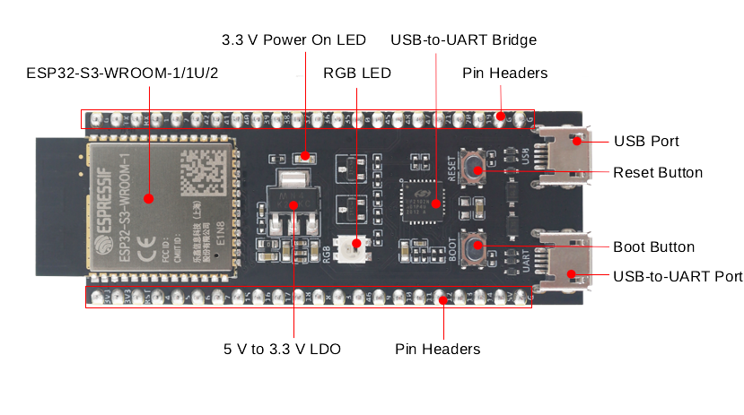
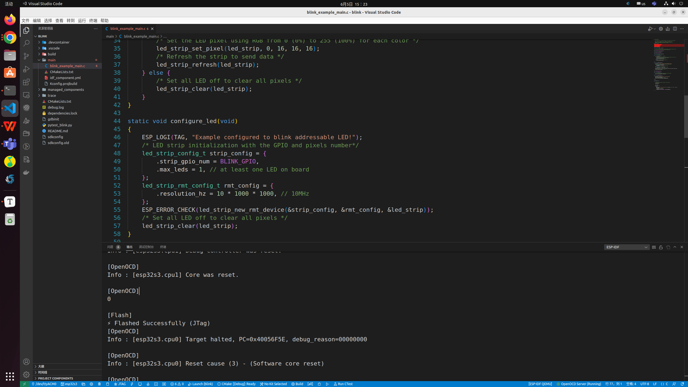

# Report of JTAG

## Introduction：

Figuring out a bug that is caused by two threads, running even simultaneously on two different CPU cores, can take a long time when all you have are printf () statements. A better (and in many cases quicker) way to debug such problems is by using a debugger, connected to the processors over a debug port. This is what JTAG does.


## Preparation：

### Hardware：

- An **ESP32S3** board.
- **USB cable** - USB A / micro USB B.
- **Computer** running Windows, Linux, or macOS.


#### hardware settings

Using the ESP32-S3-DevKitC-1 development board as an example:

The development board features two USB interfaces,One is the USB Port, and the other is the USB-to-UART Port.


**Port description:**



**USB Port** ：ESP32-S3 full-speed USB OTG interface, compliant with the USB 1.1 specification. The interface is used for power supply to the board, for flashing applications to the chip, for communication with the chip using USB 1.1 protocols, as well as for JTAG debugging.


**USB-to-UART Port** ：A Micro-USB port used for power supply to the board, for flashing applications to the chip, as well as for communication with the chip via the on-board USB-to-UART bridge.


So,JTAG needs to use USB Port to connect the development board to the computer


### software preparation

1. [VSCode Extension](https://github.com/espressif/vscode-esp-idf-extension/blob/master/docs/tutorial/install.md)

2. [Linux and macOS](https://docs.espressif.com/projects/esp-idf/en/latest/esp32s3/get-started/linux-macos-setup.html)

3. Install OpenOCD

   If you have already set up ESP-IDF with CMake build system according to the [Getting Started Guide](https://docs.espressif.com/projects/esp-idf/en/latest/esp32/get-started/index.html), then OpenOCD is already installed. After [setting up the environment](https://docs.espressif.com/projects/esp-idf/en/latest/esp32/get-started/linux-macos-setup.html#get-started-set-up-env) in your terminal, you should be able to run OpenOCD. Check this by executing the following command:

   ```shell
   	openocd --version
   ```

   The output should be as follows (although the version may be more recent than listed here):

   ```shell
   Open On-Chip Debugger 0.11.0
   Licensed under GNU GPL v2
   For bug reports, read
   	http://openocd.org/doc/doxygen/bugs.html
   
   ```


## JTAG debug settings(vscode)：

### vscode settings：

1. **Set the interface:**
   Select the /dev/ttyACM0 serial port.

2. **Set the chip type.**
   Select an Espressif target (esp32, esp32s2, etc.) with the **ESP-IDF: Set Espressif device target** command. Default is `esp32` and the one used in this tutorial.

3. **Compile the files and download**

4. **JTAG debug**

   

   


## JTAG debug example（vs code）：

1. **create a new "blink" project**

2. **Perform the following configurations at the bottom of the UI**

   ESP-IDF: Set Espressif device target  :  esp32s3

   ESP-IDF: Select Flash Method : JTAG

   ESP-IDF: Select port to use :  usbserial

   

3. **Build project and flash device**

4. **Begin debug**  **(F5)**


**TIP：command method:**

| command shortcuts | function              |
| ----------------- | --------------------- |
| F5                | continue              |
| F10               | step over             |
| F11               | single step debugging |
| Shift + F10       | step out              |
| Shift + F5        | stop                  |


## JTAG debug example (Command )

1. **open idf.py**

   ```shell
   cd blink
   . $HOME/esp/esp-idf/export.sh
   ```

2. **set ESP32-S3 as the target，build the project**

   ```shell
   idf.py set-target esp32s3
   idf.py build
   ```

3. **download**

   ```
   idf.py flash
   ```

4. **gdb**

   ```
   idf.py gdbtui
   ```

   

- break  num ---------- set breakpoint
- c              ---------------continue

