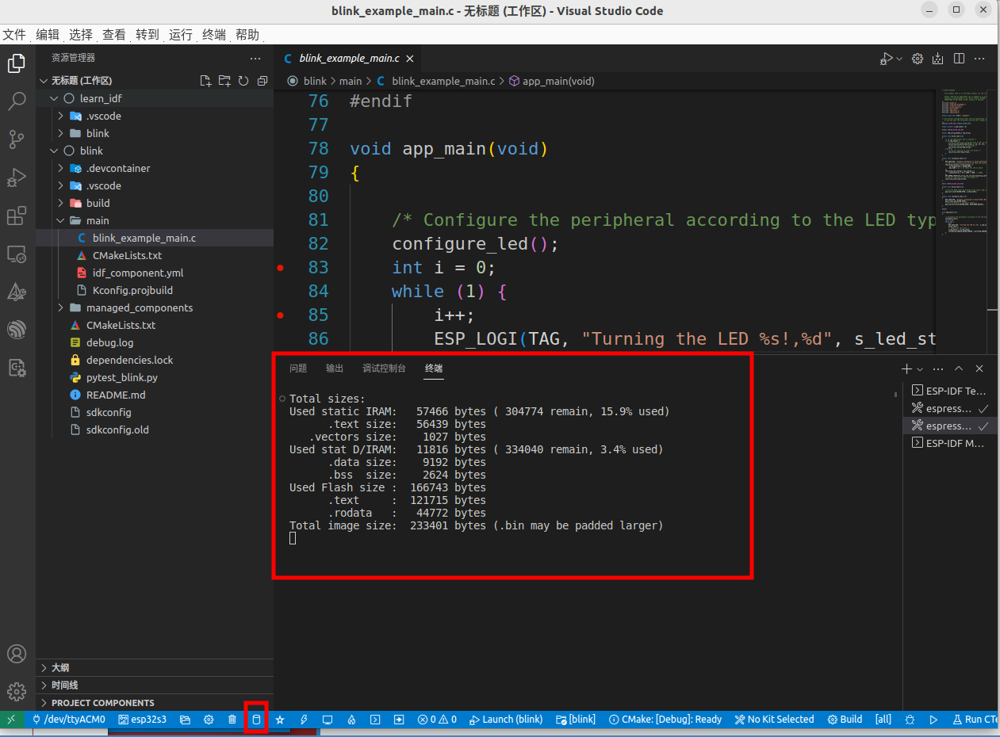

# JTAG使用手册

## 准备工作：

### 硬件：

#### 必备硬件

- ESP32-S3-DevKitC-1
- USB 2.0 数据线（标准 A 型转 Micro-B 型）
- 电脑（Windows、Linux 或 macOS）


#### 硬件设置

以ESP32-S3-DevKitC-1开发板举例：

该开发板有两个USB 接口，其中一个为USB Port，另一个为USB-to-UART Port


USB Port（USB 接口）：ESP32-S3 USB OTG 接口，支持全速 USB 1.1 标准。ESP32-S3 USB 接口可用作开发板的供电接口，可烧录固件至芯片，可通过 USB 协议与芯片通信，也可用于 JTAG 调试。


USB-to-UART Port（USB 转 UART 接口）：Micro-USB 接口，可用作开发板的供电接口，可烧录固件至芯片，也可作为通信接口，通过板载 USB 转 UART 桥接器与芯片通信。


JTAG需要使用**SP32-S3 USB 接口** 连接开发板与电脑


### 软件（详情见以下教程）

1. vscode安装：https://github.com/espressif/vscode-esp-idf-extension/blob/master/docs/tutorial/install.md
2. 平台工具链安装：https://docs.espressif.com/projects/esp-idf/zh_CN/latest/esp32s3/get-started/linux-macos-setup.html


## JTAG调试设置(vscode版本)：

我们使用官网提供的例程，get-starting/blink作为示例程序

### 相关的设置

#### 选择project

打开程序所在的文件夹，当有多个文件的时候，将想要调试的文件添加到工作区，（shift + ctrl +p 打开命令面板输入 add folder to workspace 添加文件）


#### 设置下载的端口：

选择/dev/ttyACM0接口


#### 设置芯片类型

选择芯片类型(esp32s3)以及下载方式(USB-JTAG))


#### 选择当前文件夹


#### 选择活动的project


#### 编译文件并且下载

编译文件，编译完毕后终端打印信息如下：




下载文件到板子上，下载后的终端输出信息如下（如果提示打开openocd 点击yes）：


## JTAG调试

为了进一步介绍jtag的功能 我们简单修改一下例程代码。

在第83行加入

```c
int i = 10;
```

在第85行加入

```c
i++
```

修改后的代码截图：


代码修改完毕后，按F5或者底部的Launch即可开启Jtag调试


由图可知，jtag调试主要由四个部分组成，分别是变量，监视，调用堆栈以及断点


- 变量：代码段中的变量的值
- 监视：可以手动设置想要查看的信号
- 调用堆栈：可以观察代码中的堆栈情况
- 断点：可以设置断点 


**TIP：使用命令方法：**

| 命令快捷键  | 命令用途 |
| ----------- | -------- |
| F5          | 继续     |
| F10         | 单步跳过 |
| F11         | 单步调试 |
| Shift + F10 | 单步跳出 |
| Shift + F5  | 停止调试 |


如果想同时观察打印信息，可以将监视和调试一块使用

监视和调试一块使用  先打开监视窗口 然后F5开始调试，效果如下


在我们自己修改的代码中，我们可以看到i的值在不断变化


## 命令行版本来使用JTAG调试

1. 打开idf.py

   ```
   . $HOME/esp/esp-idf/export.sh
   ```

   终端打印如下信息：

2. 设置相关芯片，编译相关文件 然后下载进去

   设置芯片类型

   ```shell
   idf.py set-target esp32s3
   ```

   编译程序：

   ```
   idf.py build
   ```

   

3. 将编译的文件下载进芯片

   ```c
   //直接让其自动匹配
   idf.py flash
   ```

   

4. 打开openocd

   ```
   idf.py openocd
   ```

   如果端口占用报错，如图
   
   输入lsof -i:6666 查看相关进程，并且关闭，如图所示：

   

   正确打开openocd后终端输入：

   

5. idf.py开始调试gdb

   ```
   idf.py gdbtui
   ```

   

这里就正常打断点就好了，然后和正常的GDB调试

相关命令及示例请看：
