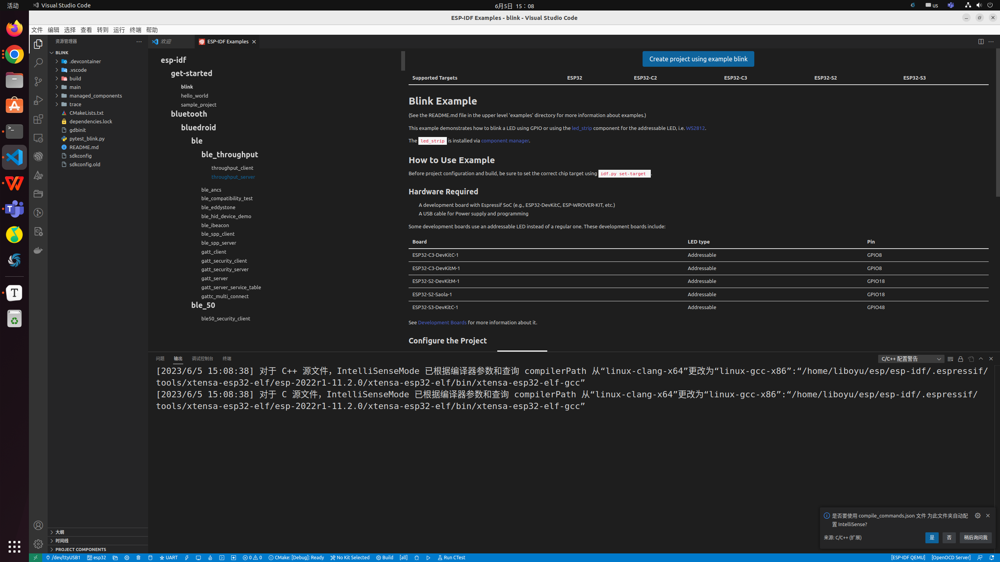

# JTAG报告

## 引言：

由于缺乏合适的工具，简便的编程方式也会给程序的调试带来困难，比如找出由两个线程引起的错误，并且这两个线程在单独的 CPU 核上同时运行，那么仅凭 `printf` 语句会花费很长时间来定位该错误。调试此类问题更好(往往也更快)的方法是使用调试器，将其连接到处理器的调试端口。

## JTAG工作原理：

**以ESP32S3举例：**


## 准备工作：

### 硬件：

#### 必备硬件

- ESP32-S3-DevKitC-1
- USB 2.0 数据线（标准 A 型转 Micro-B 型）
- 电脑（Windows、Linux 或 macOS）


#### 硬件设置

以ESP32-S3-DevKitC-1开发板举例：

该开发板有两个USB 接口，其中一个为USB Port，另一个为USB-to-UART Port


USB Port（USB 接口）：ESP32-S3 USB OTG 接口，支持全速 USB 1.1 标准。ESP32-S3 USB 接口可用作开发板的供电接口，可烧录固件至芯片，可通过 USB 协议与芯片通信，也可用于 JTAG 调试。


USB-to-UART Port（USB 转 UART 接口）：Micro-USB 接口，可用作开发板的供电接口，可烧录固件至芯片，也可作为通信接口，通过板载 USB 转 UART 桥接器与芯片通信。


JTAG需要使用**SP32-S3 USB 接口** 连接开发板与电脑


### 软件（详情见以下教程）

1. vscode安装：https://github.com/espressif/vscode-esp-idf-extension/blob/master/docs/tutorial/install.md
2. 平台工具链安装：https://docs.espressif.com/projects/esp-idf/zh_CN/latest/esp32s3/get-started/linux-macos-setup.html


## JTAG调试设置(vscode版本)：

### 安装 OpenOCD

如果已经完成了软件的安装，那么openocd已经默认安装完毕，可以输入如下命令：

```shell
	openocd --version
```

终端会输出：

```shell
Open On-Chip Debugger 0.11.0
Licensed under GNU GPL v2
For bug reports, read
	http://openocd.org/doc/doxygen/bugs.html

```

### 相关的设置

#### 设置接口：


选择/dev/ttyACM0接口


#### 设置芯片类型

First the user should select an Espressif target (esp32, esp32s2, etc.) with the **ESP-IDF: Set Espressif device target** command. Default is `esp32` and the one used in this tutorial.


#### 编译文件并且下载


#### JTAG调试

摁F5或者底部的Launch


右边显示相关的变量以及寄存器还有堆栈


## vscode版本（示例）：

1. 新建一个工程 blink为例，
2. 选择端口ESP-IDF: Select port to use (COM, tty, usbserial)选择ESP32S3、芯片类型ESP-IDF: Set Espressif device target（JTAG）、下载类型 ESP-IDF: Select Flash Method（JTAG）
3. 编译文件  并且刷新flash
4. 开始调试F5


可以观察堆栈、断点等问题

https://github.com/espressif/vscode-esp-idf-extension/blob/1bf71f1f54c66cefc3f0e3362cc5c9e724f2cb9b/docs/tutorial/debugging.md

**TIP：使用命令方法：**

| 命令快捷键  | 命令用途 |
| ----------- | -------- |
| F5          | 继续     |
| F10         | 单步跳过 |
| F11         | 单步调试 |
| Shift + F10 | 单步跳出 |
| Shift + F5  | 停止调试 |


使用方法：


监视和调试一块使用  先打开监视窗口 然后开始调试


## 命令行版本来使用JTAG调试

1. 打开idf.py

   ```
   . $HOME/esp/esp-idf/export.sh
   ```

2. 设置相关芯片，编译相关文件 然后下载进去

   ```shell
   idf.py set-target esp32s3
   idf.py build
   ```

3. 将编译的文件下载进芯片

   ```
   有两种方法，官网给的没有跑通，配置不上，可以让他自动配置
   idf.py flash
   ```

   

4. idf.py开始调试gdb

   ```
   idf.py gdbtui
   ```

   

这里就正常打断点就好了，然后和正常的GDB调试
