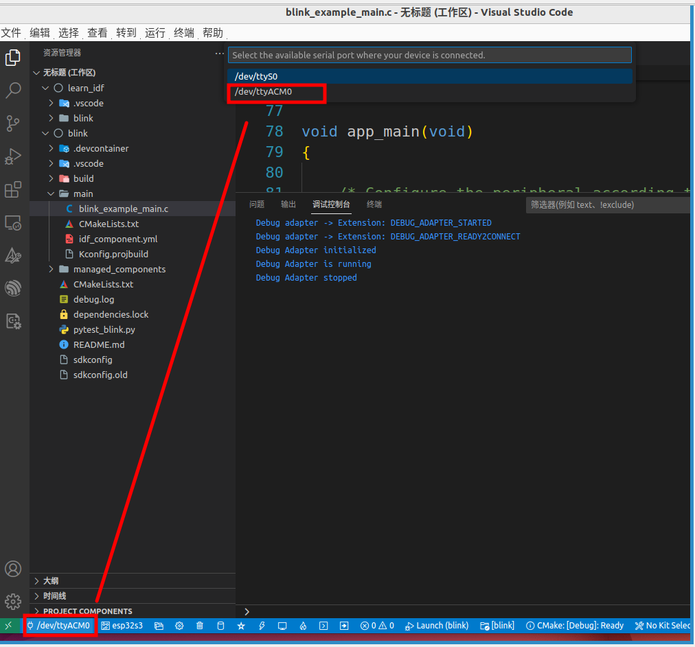
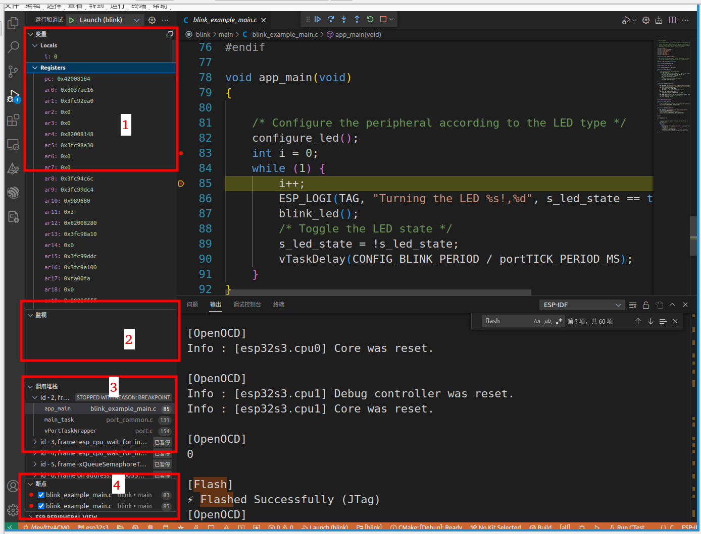
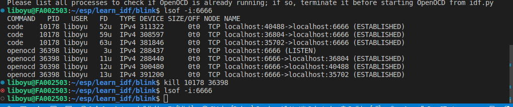

# JTAG User Manual

## Preparation:

### Hardware:

#### Required Hardware

- ESP32-S3-DevKitC-1
- USB 2.0 cable (Standard Type A to Micro-B)
- Computer (Windows, Linux, or macOS)


#### Hardware settings

Using the ESP32-S3-DevKitC-1 development board as an example:

The development board has two USB interfaces, one is the USB Port, and the other is the USB-to-UART Port.


**Port description:**


| port             | function                                                     |
| ---------------- | ------------------------------------------------------------ |
| USB Port         | ：ESP32-S3 full-speed USB OTG interface, compliant with the USB 1.1 specification. The interface is used for power supply to the board, for flashing applications to the chip, for communication with the chip using USB 1.1 protocols, as well as for JTAG debugging. |
| USB-to-UART Port | A Micro-USB port used for power supply to the board, for flashing applications to the chip, as well as for communication with the chip via the on-board USB-to-UART bridge. |


To use JTAG, you need to connect the development board to your computer using the **ESP32-S3 USB interface**.


### Software preparation

1. [VSCode Extension](https://github.com/espressif/vscode-esp-idf-extension/blob/master/docs/tutorial/install.md)

2. [Linux and macOS](https://docs.espressif.com/projects/esp-idf/en/latest/esp32s3/get-started/linux-macos-setup.html)

   

### JTAG(Vscode setting)

#### (Optional) Add folder to workspace

Open the folder where the program is located. If there are multiple files, add the file you want to debug to the workspace.（shift + ctrl +p ->  Command Palette... and  add folder to workspace ）


#### Set the download port 

Select the port "/dev/ttyACM0"




#### Set the chip type

**ESP-IDF: Set Espressif device target** : select esp32s3 

ESP-IDF Select flash method : esp32s3 -> via builtin USB-JTAG


#### Select the current folder.


#### (Optional)Select the active project.


#### Build and flash

After compiling the file, the terminal displays the following information:


Flash the file to the board. After the Flash device is complete, the terminal displays the following output (if prompted to open OpenOCD, click "Yes"):


## JTAG debug

To further introduce the functionality of JTAG, let's make a slight modification to the example code.

Add the following code to line 83:

```c
int i = 10;
```

Add the following code to line85:

```c
i++
```

Screenshot of the modified code:


After the code modification is complete, you can initiate JTAG debugging by pressing F5 or clicking on the "Launch" button at the bottom.



From the image, it can be seen that JTAG debugging mainly consists of four components: Variables, Watches, Call Stack, and Breakpoints.


- Variables: The values of variables in the code segment.
- Watches: Allows manual setting of signals to be monitored.
- Call Stack: Allows observation of the stack situation in the code.
- Breakpoints: Allows setting of breakpoints in the code.


**TIP：使用命令方法：**

| Command Shortcuts: Functions |                          |
| ---------------------------- | ------------------------ |
| F5                           | Start/Continue Debugging |
| F10                          | Step Over                |
| F11                          | Step Into                |
| Shift + F10                  | Step out                 |
| Shift + F5                   | stop                     |


If you want to observe print statements while debugging, you can use the monitor device alongside the debugging process.


In the code you have modified, you can see that the value of "i" is constantly changing.


#### Condition breakpoint


can see the result as follow：


## JTAG(command)

1. Open  idf.py

   ```
   . $HOME/esp/esp-idf/export.sh
   ```

   The terminal prints the following information:

2. Set the chip type，build 

   Set the chip type

   ```shell
   idf.py set-target esp32s3
   ```

   build :

   ```
   idf.py build
   ```

   

3. Flash device

   ```c
   //直接让其自动匹配
   idf.py flash
   ```

   

4. Open openocd

   ```
   idf.py openocd
   ```

   If it have error as follow:
   

   use  lsof -i:6666  View related processes and close it，as follow：

   

   if you open openocd  normal  ,the terminal prints the following information:

   

   Configuration of OpenOCD for Specific Target:

   There are several kinds of OpenOCD configuration files (`*.cfg`). All configuration files are located in subdirectories of `share/openocd/scripts` directory of OpenOCD distribution (or `tcl/scripts` directory of the source repository). For the purposes of this guide, the most important ones are `board`, `interface` and `target`.

   - `interface` configuration files describe the JTAG adapter. Examples of JTAG adapters are ESP-Prog and J-Link.
   - `target` configuration files describe specific chips, or in some cases, modules.
   - `board` configuration files are provided for development boards with a built-in JTAG adapter. Such files include an `interface` configuration file to choose the adapter, and `target` configuration file to choose the chip/module.

   The following configuration files are available for ESP32-S3:

   | Name                                  | Description                                                  |
   | ------------------------------------- | ------------------------------------------------------------ |
   | `board/esp32s3-builtin.cfg`           | Board configuration file for ESP32-S3 for debugging via builtin USB JTAG, includes target and adapter configuration. |
   | `board/esp32s3-ftdi.cfg`              | Board configuration file for ESP32-S3 for via externally connected FTDI-based probe like ESP-Prog, includes target and adapter configuration. |
   | `target/esp32s3.cfg`                  | ESP32-S3 target configuration file. Can be used together with one of the `interface/` configuration files. |
   | `interface/ftdi/esp_usb_jtag.cfg`     | JTAG adapter configuration file for ESP32-S3 builtin USB JTAG. |
   | `interface/ftdi/esp32_devkitj_v1.cfg` | JTAG adapter configuration file for ESP-Prog debug adapter board. |

   If you are using one of the boards which have a pre-defined configuration file, you only need to pass one `-f` argument to OpenOCD, specifying that file.

   If you are using a board not listed here, you need to specify both the interface configuration file and target configuration file.

5. Begin gdb 

   ```
   idf.py gdbtui
   ```

   

GDB related commands and examples as follow:

https://gitlab.espressif.cn:6688/jialin/practice/-/blob/feature/report_lby/others/gdb_learn.md
