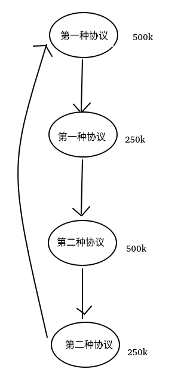
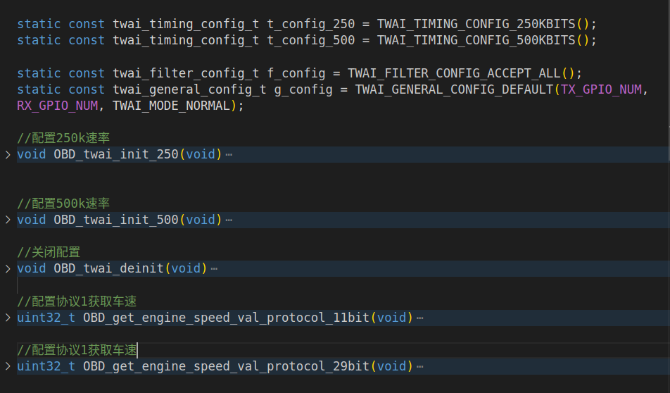
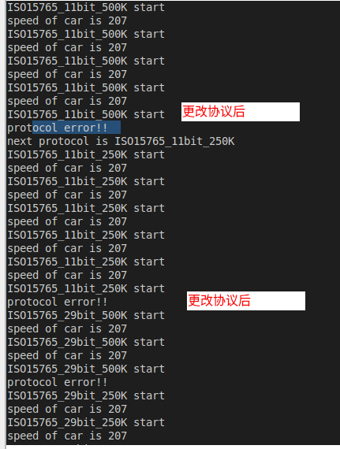

# OBD实验

代码在hello_world文件夹中


## 解决问题

1.esp32这端如何自动识别不同的CAN的速率

2.对于不同的OBD协议 esp32这段如何同时支持


## 思路：

对于这两个问题，使用轮询查找的方式，目前可以支持两种协议和两种不同速率共计四种情况。


### 第一个问题

CAN总线速率在OBD中主要是500K和250K,所以当通信的时候首先探测500K速率，看看能否正确读出数据，如果不能，则调整为250K速率进行探测。当获得正确数据时，保持这种速率进行数据传输

```c
static const twai_timing_config_t t_config_250 = TWAI_TIMING_CONFIG_250KBITS();
static const twai_timing_config_t t_config_500 = TWAI_TIMING_CONFIG_500KBITS();

```


### 第二个问题

和第一个问题一样，首先查看第一种协议是否能读取正确的数据，如果不能，调整为第二种协议，这样就可以满足要求


### 整体思路

利用状态机来实现，轮询查找正确的协议，如果不正确，转移到下一个状态，直到找到正确的协议为止




## 主函数的情况

枚举四种情况，并且使用状态机来进行状态的转移，主函数循环发送获得车速的请求，直到得到车速，得到后保持这种状态不变

```c
enum 
{
    ISO15765_11bit_500K=1, 
    ISO15765_11bit_250K, 
    ISO15765_29bit_500K, 
    ISO15765_29bit_250K
}protocol;

uint8_t protocol_cur = ISO15765_11bit_500K; //当前协议
uint32_t now_speed; //汽车的速度


void app_main(void)
{
	
    while (1)
    {   
        vTaskDelay(100);
        
        //状态机实现轮询探测
        switch (protocol_cur)
        {
        case ISO15765_11bit_500K:
            printf("ISO15765_11bit_500K start\n");
            //配置这个协议得TWAI总线
            OBD_twai_init_500();
            //获取车速，获取失败则进入下一个协议继续探测，剩下同理
            now_speed = OBD_get_engine_speed_val_protocol_11bit();
            if (now_speed == -1)
            {
                protocol_cur = ISO15765_11bit_250K;
                printf("next protocol is ISO15765_11bit_250K\n");
              // 
            }else{
                printf("speed of car is %ld\n",now_speed);
            }
             OBD_twai_deinit();
        break;

        case ISO15765_11bit_250K:
            printf("ISO15765_11bit_250K start\n");
            OBD_twai_init_250();
            now_speed = OBD_get_engine_speed_val_protocol_11bit();
            if (now_speed == -1)
            {
                protocol_cur = ISO15765_29bit_500K;
                //
            }else{
                printf("speed of car is %ld\n",now_speed);
            }
            OBD_twai_deinit();
        break;

        case ISO15765_29bit_500K:
            printf("ISO15765_29bit_500K start\n");
            OBD_twai_init_500();
            now_speed = OBD_get_engine_speed_val_protocol_29bit();
            if (now_speed == -1)
            {
                protocol_cur = ISO15765_29bit_250K;
               // OBD_twai_deinit();
            }else{
                printf("speed of car is %ld\n",now_speed);
            }
            OBD_twai_deinit();
        break;

        case ISO15765_29bit_250K:
            printf("ISO15765_29bit_250K start\n");
            OBD_twai_init_250();
            now_speed = OBD_get_engine_speed_val_protocol_29bit();
            if (now_speed == -1)
            {
                protocol_cur = ISO15765_11bit_500K;
               // OBD_twai_deinit();
            }else{
                printf("speed of car is %ld\n",now_speed);
            }
            OBD_twai_deinit();
        break;

        default:
            printf("event error\n");
            break;
        }
    }
   
}

```


## OBD函数情况

共计使用5个函数，作用如下图




具体代码如下：

```c
//基础配置
static const twai_timing_config_t t_config_250 = TWAI_TIMING_CONFIG_250KBITS();
static const twai_timing_config_t t_config_500 = TWAI_TIMING_CONFIG_500KBITS();

static const twai_filter_config_t f_config = TWAI_FILTER_CONFIG_ACCEPT_ALL();
static const twai_general_config_t g_config = TWAI_GENERAL_CONFIG_DEFAULT(TX_GPIO_NUM, RX_GPIO_NUM, TWAI_MODE_NORMAL);

//配置250k速率
void OBD_twai_init_250(void)
{
    ESP_ERROR_CHECK(twai_driver_install(&g_config, &t_config_250, &f_config));
    //printf("Driver installed\n");

    ESP_ERROR_CHECK(twai_start());
   // printf("Driver started\n");
}


//配置500k速率
void OBD_twai_init_500(void)
{
    ESP_ERROR_CHECK(twai_driver_install(&g_config, &t_config_500, &f_config));
    //printf("Driver installed\n");

    ESP_ERROR_CHECK(twai_start());
   // printf("Driver started\n");
}

//关闭配置
void OBD_twai_deinit(void)
{
    ESP_ERROR_CHECK(twai_stop());
   // printf("Driver stopped\n");

    ESP_ERROR_CHECK(twai_driver_uninstall());
   // printf("Driver uninstalled\n");
 }

//配置协议1获取车速
uint32_t OBD_get_engine_speed_val_protocol_11bit(void)
{
    uint8_t data_len_rel;
    uint32_t engine_speed = 0;
    /* 获取发动机转速的格式：
       id：0x7df
       数据位：8
       data[0]:0x02 代表接下来7个数据字节中有效的字节数为2
       data[1]:0x01 代表要获取动力相关数据
       data[2]:0x0d 代表车速
    */
    twai_message_t tx_msg = {.flags = TWAI_MSG_FLAG_NONE, .identifier = MSG_ID, .data_length_code = 8, .data = {0x02, 0x01, 0x0D, 0x00, 0x00, 0x00, 0x00, 0x00}};
    twai_message_t rx_msg;

    int flag_tran = twai_transmit(&tx_msg, pdMS_TO_TICKS(1000));

    int flag_rec = twai_receive(&rx_msg, pdMS_TO_TICKS(1000));
     if (flag_rec == ESP_ERR_TIMEOUT )
    {
        printf("protocol error!!\n");
        return -1;
    }
    

    // OBD模拟器回复的数据帧id为0x7e8
    if (rx_msg.identifier != 0x7e8)
    {
        printf("Get CAN frame id error!!\n");
        return -1;
    }

   
    // data[0]代表接下来7个数据字节有效的字节数
    data_len_rel = rx_msg.data[0];
    if (data_len_rel < 2 || data_len_rel > 7)
    {
        printf("Get data rel len error!!\n");
        return -1;
    }

    // receive data[1]为send data[1] + 0x40    receive data[2]等于send data[2]
    if (rx_msg.data[1] != tx_msg.data[1] + 0x40 || rx_msg.data[2] != tx_msg.data[2])
    {
        printf("Get data return message error!!\n");
        return -1;
    }

    
    
    for (int i = 3; i < data_len_rel+1; i++)
    {
        engine_speed = engine_speed*16 + rx_msg.data[i];
    }
    

    return engine_speed ;
}

//配置协议2获取车速
uint32_t OBD_get_engine_speed_val_protocol_29bit(void)
{
    uint8_t data_len_rel;
    uint32_t engine_speed = 0;

    twai_message_t tx_msg = {.flags = TWAI_MSG_FLAG_EXTD, .identifier = MSG_ID_EXP, .data_length_code = 8, .data = {0x02, 0x01, 0x0D, 0x00, 0x00, 0x00, 0x00, 0x00}};
    twai_message_t rx_msg;

    esp_err_t flag_tran = twai_transmit(&tx_msg, pdMS_TO_TICKS(1000));

    esp_err_t flag_rec = twai_receive(&rx_msg, pdMS_TO_TICKS(1000));
    if (flag_rec == ESP_ERR_TIMEOUT )
    {
        printf("protocol error!!\n");
        return -1;
    }
    

     if (rx_msg.identifier != 0x18daf110)
    {
        printf("Get CAN frame id error!!\n");
        return -1;
    }
    // data[0]代表接下来7个数据字节有效的字节数
    data_len_rel = rx_msg.data[0];
    if (data_len_rel < 2 || data_len_rel > 7)
    {
        printf("Get data rel len error!!\n");
        return -1;
    }

    // receive data[1]为send data[1] + 0x40    receive data[2]等于send data[2]
    if (rx_msg.data[1] != tx_msg.data[1] + 0x40 || rx_msg.data[2] != tx_msg.data[2])
    {
        printf("Get data return message error!!\n");
        return -1;
    }

    
    
    for (int i = 3; i < data_len_rel+1; i++)
    {
        engine_speed = engine_speed*16 + rx_msg.data[i];
    }
    

    return engine_speed ;
}
```


## 效果

效果如下图所示，当更改协议后，可以实现自动检测，并且读出数据


