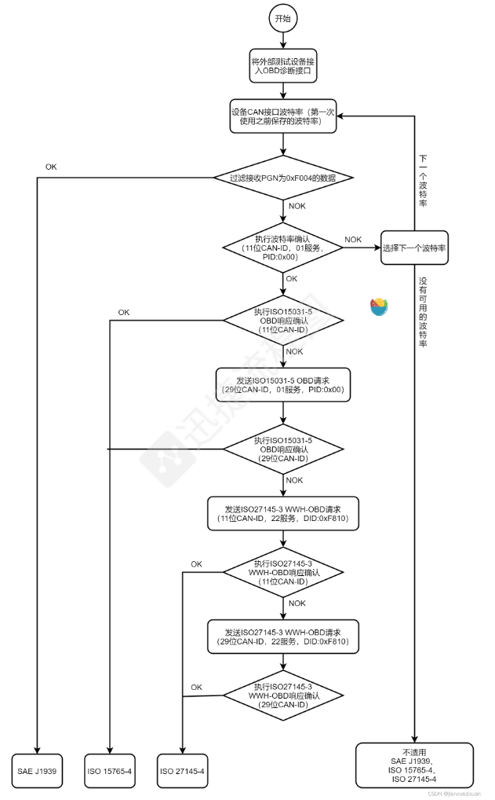

# OBD实验

## 基本的配置

```c
static const twai_timing_config_t t_config = TWAI_TIMING_CONFIG_500KBITS();
static const twai_filter_config_t f_config = TWAI_FILTER_CONFIG_ACCEPT_ALL();
static const twai_general_config_t g_config = TWAI_GENERAL_CONFIG_DEFAULT(TX_GPIO_NUM, RX_GPIO_NUM, TWAI_MODE_NORMAL);


void OBD_twai_init(void)
{
    ESP_ERROR_CHECK(twai_driver_install(&g_config, &t_config, &f_config));
    printf("Driver installed\n");

    ESP_ERROR_CHECK(twai_start());
    printf("Driver started\n");
}


void OBD_twai_deinit(void)
{
    ESP_ERROR_CHECK(twai_stop());
    printf("Driver stopped\n");

    ESP_ERROR_CHECK(twai_driver_uninstall());
    printf("Driver uninstalled\n");
 }
```


## 协议1和2方法

```c
#define MSG_ID 0x7DF // 11 bit standard format ID

uint32_t OBD_get_engine_speed_val(void)
{
    uint8_t data_len_rel;
    uint32_t engine_speed = 0;
    /* 获取发动机转速的格式：
       id：0x7df
       数据位：8
       data[0]:0x02 代表接下来7个数据字节中有效的字节数为2
       data[1]:0x01 代表要获取动力相关数据
       data[2]:0x0c 代表发动机转速
    */
    twai_message_t tx_msg = {.flags = TWAI_MSG_FLAG_NONE, .identifier = MSG_ID, .data_length_code = 8, .data = {0x02, 0x01, 0x0D, 0x00, 0x00, 0x00, 0x00, 0x00}};
    twai_message_t rx_msg;
    printf("step1\n");
    esp_err_t flag_tran = twai_transmit(&tx_msg, pdMS_TO_TICKS(1000));
    printf("step2   and  flag_tran = %d\n",flag_tran);
    esp_err_t flag_rec = twai_receive(&rx_msg, pdMS_TO_TICKS(1000));
     printf("step3   and  flag_rec = %d\n",flag_rec);
    // OBD模拟器回复的数据帧id为0x7e8
    if (rx_msg.identifier != 0x7e8)
    {
        printf("Get CAN frame id error!!\n");
        return -1;
    }

    // data[0]代表接下来7个数据字节有效的字节数
    data_len_rel = rx_msg.data[0];
    if (data_len_rel < 2 || data_len_rel > 7)
    {
        printf("Get data rel len error!!\n");
        return -1;
    }

    // receive data[1]为send data[1] + 0x40    receive data[2]等于send data[2]
    if (rx_msg.data[1] != tx_msg.data[1] + 0x40 || rx_msg.data[2] != tx_msg.data[2])
    {
        printf("Get data return message error!!\n");
        return -1;
    }

    
    
    for (int i = 3; i < data_len_rel+1; i++)
    {
        engine_speed = engine_speed*16 + rx_msg.data[i];
    }
    

    return engine_speed ;
}
```

## 扩展贞的使用方法

```
// Copyright 2015-2019 Espressif Systems (Shanghai) PTE LTD
//
// Licensed under the Apache License, Version 2.0 (the "License");
// you may not use this file except in compliance with the License.
// You may obtain a copy of the License at

//     http://www.apache.org/licenses/LICENSE-2.0
//
// Unless required by applicable law or agreed to in writing, software
// distributed under the License is distributed on an "AS IS" BASIS,
// WITHOUT WARRANTIES OR CONDITIONS OF ANY KIND, either express or implied.
// See the License for the specific language governing permissions and
// limitations under the License.

#include <stddef.h>
#include <stdio.h>
#include "OBD_simulator.h"

#define TX_GPIO_NUM 2
#define RX_GPIO_NUM 3
#define MSG_ID 0x18DB33F1 // 29 bit standard format ID

static const twai_timing_config_t t_config = TWAI_TIMING_CONFIG_250KBITS();
static const twai_filter_config_t f_config = TWAI_FILTER_CONFIG_ACCEPT_ALL();
static const twai_general_config_t g_config = TWAI_GENERAL_CONFIG_DEFAULT(TX_GPIO_NUM, RX_GPIO_NUM, TWAI_MODE_NORMAL);

void OBD_twai_init(void)
{
    ESP_ERROR_CHECK(twai_driver_install(&g_config, &t_config, &f_config));
    printf("Driver installed\n");

    ESP_ERROR_CHECK(twai_start());
    printf("Driver started\n");
}

void OBD_twai_deinit(void)
{
    ESP_ERROR_CHECK(twai_stop());
    printf("Driver stopped\n");

    ESP_ERROR_CHECK(twai_driver_uninstall());
    printf("Driver uninstalled\n");
 }

uint32_t OBD_get_engine_speed_val(void)
{
    uint8_t data_len_rel;
    uint32_t engine_speed = 0;
    /* 获取发动机转速的格式：
       id：0x7df
       数据位：8
       data[0]:0x02 代表接下来7个数据字节中有效的字节数为2
       data[1]:0x01 代表要获取动力相关数据
       data[2]:0x0d 代表车速
    */
    twai_message_t tx_msg = {.flags = TWAI_MSG_FLAG_EXTD, .identifier = MSG_ID, .data_length_code = 8, .data = {0x02, 0x01, 0x0D, 0x00, 0x00, 0x00, 0x00, 0x00}};
    twai_message_t rx_msg;
    printf("step1\n");
    esp_err_t flag_tran = twai_transmit(&tx_msg, pdMS_TO_TICKS(2000));
    printf("step2   and  flag_tran = %d\n",flag_tran);
    esp_err_t flag_rec = twai_receive(&rx_msg, pdMS_TO_TICKS(5000));
     printf("step3   and  flag_rec = %d\n",flag_rec);
     printf("rec data : %ld\n",rx_msg.identifier);
    // OBD模拟器回复的数据帧id为0x7e8
    // if (rx_msg.identifier != 0x7e8)
    // {
    //     printf("Get CAN frame id error!!\n");
    //     return -1;
    // }

     if (rx_msg.identifier != 0x18daf110)
    {
        printf("Get CAN frame id error!!\n");
        return -1;
    }
    // data[0]代表接下来7个数据字节有效的字节数
    data_len_rel = rx_msg.data[0];
    if (data_len_rel < 2 || data_len_rel > 7)
    {
        printf("Get data rel len error!!\n");
        return -1;
    }

    // receive data[1]为send data[1] + 0x40    receive data[2]等于send data[2]
    if (rx_msg.data[1] != tx_msg.data[1] + 0x40 || rx_msg.data[2] != tx_msg.data[2])
    {
        printf("Get data return message error!!\n");
        return -1;
    }

    
    
    for (int i = 3; i < data_len_rel+1; i++)
    {
        engine_speed = engine_speed*16 + rx_msg.data[i];
    }
    

    return engine_speed ;
}
```


## 


