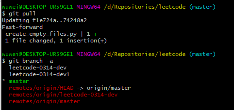

# Git学习

##  git的工作流程

工作流程如下 

1. 从远程仓库中克隆代码到本地仓库
2. 从本地仓库中checkout代码然后进行代码修改
3. 在提交前先将代码提交到暂存区
4. 提交到本地仓库。本地仓库中保存修改的各个历史版本
5. 修改完成后，需要和团队成员共享代码时，将代码push到远程仓库

 

## git代码托管服务


##  Git常用命令

 

Git提供了很多命令来完成相应的操作，为了方便学习，我们将这些命令进行了分类。在学习命令的过程中会讲解些Git相关的概念

 

1. 环境配置
2. 获取Git仓库
3. 工作目录、暂存区以及版本库概念
4. Git工作目录下文件的两种状态
5. 本地仓库操作
6. 远程仓库的使用
7. 分支
8. 标签

 

### 配置相关环境

当安装Git后首先要做的事情是设置用户名称和email地址这是非常重要的，因为每次Git提交都会使用该用户信息

 

设置用户信息

```shell
git config --globaluser.name "itcast”

git config --globaluser.email "[hello@itcast.cn](mailto:hello@itcast.cn)"
```

 

查看配置信息

```shell
git config --list

git config user.name 
```

通过上面的命令设置的信息会保存在~<gitconfig文件中


###  获取Git仓库 

要使用Git对我们的代码进行版本控制，首先需要获得Git仓库

获取Git仓库通常有两种方式:

\- 在本地初始化一个Git仓库

\- 从远程仓库克隆

 

#### 本地初始化一个git仓库

 

```shell
使用 

git init

命令初始化一个Git仓库
```

 

#### 远程克隆一个Git仓库

 

```shell
使用

git clone + 地址  

的方法将所需要的文件克隆到本地
```

 

### 工作目录、暂存区以及版本库概念

为了更好的学习Git，我们需要了解Git相关的一些概念，这些概念在后面的学习中会经常提到

1. **版本库**:前面看到的.git隐藏文件夹就是版本库，版本库中存储了很多配置信息、日志信息和文件版本信息等
2. **工作目录(工作区)**:包含git文件夹的目录就是工作目录，主要用于存放开发的代码
3. **暂存区**:git文件夹中有很多文件，其中有一个index文件就是暂存区，也可以叫做stage。暂存区是一个临时保存修改文件的地方

 


 

### Git工作目录下文件的两种状态

 

Git工作目录下的文件存在两种状态

 

- \- untracked未跟踪(未被纳入版本控制) 

- \- tracked已跟踪(被纳入版本控制) 

-  \- Unmodified未修改状态

-  \- Modified 已修改状态

-  \- Staged已暂存状态


 **这些文件的状态会随着我们执行Git的命令发生变化**


**查看文件状态**

```shell
git status -s
```

 

**加入暂存区**

```shell
git add 

从问号？？变成A
```

 

 **从暂存区提交相关代码**

```shell
git commit -m "想要写的日志"
 
git commit

//自己写相关日志就好
```

 

**删除相关文件**

```shell
git rm
```

 

### 本地仓库操作

#### 用户忽略的情况

将文件添加至忽略列表般我们总会有些文件无需纳入Git的管理，也不希望它们总出现在未跟踪文件列表。

通常都是些自动生成的文件，比如日志文件或者编译过程中创建的临时文件等。在这种情况下，我们可以在工作目录中创建一个名为==.gitignore== 的文件(文件名称固定)列出要忽略的文件模式。下面是一个示例:

 


 

#### 查看日志记录 

```shell
git log
```


### 远程仓库操作

前面执行的命令操作都是针对的本地仓库，本章节我们会学习关于远程仓库的一些操作，具体包括

1. 查看远程仓库
2. 添加远程仓库
3. 从远程仓库克隆
4. 移除无效的远程仓库
5. 从远程仓库中抓取与拉取
6. 推送到远程仓库

 

#### 查看远程仓库

如果想查看已经配置的远程仓库服务器，可以运行**git remote** 命令。

它会列出指定的每一个远程服务器的简写.如果已经克隆了远程仓库，那么至少应该能看到origin，这是Git 克隆的仓库服务器的默认名字

```shell
git remote -v
```

 

####  添加远程仓库 

运行git remote add  <sfortname> <url> 添加一个新的远程Git仓库，同时指定一个可以引用的简写

 

例子如下：  

```shell
git remote add origin https://gitee.com/liboyu111/repo1.git
```

 

#### 从远程仓库克隆 

如果你想获得一份已经存在了的Git 仓库的拷贝，这时就要用到 git clone 命令。Git 克隆的是该Git 仓库服务器上的几乎所有数据(包括日志信息、历史记录等)，而不仅仅是复制工作所需要的文件。当你执行git clone 命令的时候，默认配置下远程Git仓库中的每一个文件的每一个版本都将被拉取下来克隆仓库的命令格式是

```shell
git clone url
```

  

####  移除无效的远程仓库

如果因为一些原因想要移除一个远程仓库，可以使用

```shell
git remote rm
```

**注意:此命令只是从本地移除远程仓库的记录，并不会真正影响到远程仓库**


####  从远程仓库中抓取与拉取 

**抓取**

```shell
git fetch
```

从远程仓库下载代码 不会自动合并


所以需要合并

```shell
git merge origin/master
```

 

**拉取**

```shell
git pull origin master
```

从远程仓库下载代码 **会自动合并**

 

注意:如果当前本地仓库不是从远程仓库克隆，**而是本地创建的仓库，并且仓库中存在文件**，此时再从远程仓库拉取文件的时候会报错 (fatal:refusing to merge unrelated histories)

 

解决此问题可以在gitpull命令后加入参数--allow-unrelated-histories


#### 推送到远程仓库

```shell
git push origin master
```


### 分支操作

几乎所有的版本控制系统都以某种形式支持分支。使用分支意味着你可以把你的工作从开发主线上分离开来，以免影响开发主线。Git的master分支并不是一个特殊分支，它跟其它分支没有区别。之所以几乎每一个仓库都有 master 分支，是因为git init 命令默认创建它，并且大多数人都懒得去改动它在本章节我们会学习到关于分支的相关命令，具体如下:

 

1. 查看分支
2. 创建分支
3. 切换分支
4. 推送至远程仓库分支
5. 合并分支
6. 删除分支

 

#### 查看分支

列出所有本地分支

```shell
git branch
```

列出所有远程分支 

```shell
git branch -r
```

 

列出所有本地分支和远程分支

```shell
git branch -a
```

 

#### 创建分支 

```shell
git branch b1
```

 

#### 切换分支

```shell
git checkout b1
```

 

#### 分支推送到远程仓库

```shell
git push origin b1
```

  

#### 分支的合并 

```shell
git merge b1

//在另一个分支下使用
```

 

#### 将新文件推送到远程仓库

```shell
git push origin b1
```


 

#### 删除分支

```shell
git branch -d b1
git branch -D b1 //强制删除
```

 

 

 

 

#### 删除远程分支

```shell
git push origin -d b1
//b1是远程仓库origin后面的名字
```

 


## GIT本地和远程都有分支的处理方法 

下图可知执行git pull后有从远程pull代码

原因是原来的代码是从leetcode-0314-dev push到master的，后面的话就是从master （指针在master）pull



 

 怎么选取pull的分支：

### 一、pull操作

1、将远程指定分支 拉取到 本地指定分支上：

```shell
git pull origin <远程分支名>:<本地分支名>
```

2、将远程指定分支 拉取到 本地当前分支上：

```shell
git pull origin <远程分支名>
```

3、将与本地当前分支同名的远程分支 拉取到 本地当前分支上(需先关联远程分支)

```shell
git pull origin
```

在克隆远程项目的时候，本地分支会自动与远程仓库建立追踪关系，可以使用默认的origin来替代远程仓库名，所以，我常用的命令就是 git pull origin <远程仓库名>，操作简单，安全可控。

### 二、push操作

1、将本地当前分支 推送到 远程指定分支上（注意：pull是远程在前本地在后，push相反）：

```shell
git push origin <本地分支名>:<远程分支名>
```

2、将本地当前分支 推送到 与本地当前分支同名的远程分支上（注意：pull是远程在前本地在后，push相反）：

```shell
git push origin <本地分支名>
```

3、将本地当前分支 推送到 与本地当前分支同名的远程分支上(需先关联远程分支)

```shell
git push origin
```


### Git标签

 

象其他版本控制系统(VCS)一样，Git可以给历史中的某一个提交打上标签，以示重要。比较有代表性的是人们会使用这个功能来标记发布结点(V1.0、v1.2等)。标签指的是某个分支某个特定时间点的状态。通过标签，可以很方便的切换到标记时的状态。

 

1. 列出已有的标签
2. 创建新标签
3. 将标签推送至远程仓库
4. 检出标签
5. 删除标签


#### 列出已有标签

```shell
git tag v0.1
```

 

#### 推送标签到远程仓库


```shell
git push origin v1.0
```

 

#### 检出标签

```shell
 git checkout -b b1 v1.0
b1是分支名字
```

 

#### 删除标签

```shell
git tag -d v0.1
```

 

#### 删除远程标签

```shell
git push origin:refs/tags/v0.1
```


## 重新拉的方法

1.新建git

```
git init
```

2.关联远程仓库

```
git remote add origin + url
```

3.拉分支

```
git pull origin feature:v1
```

